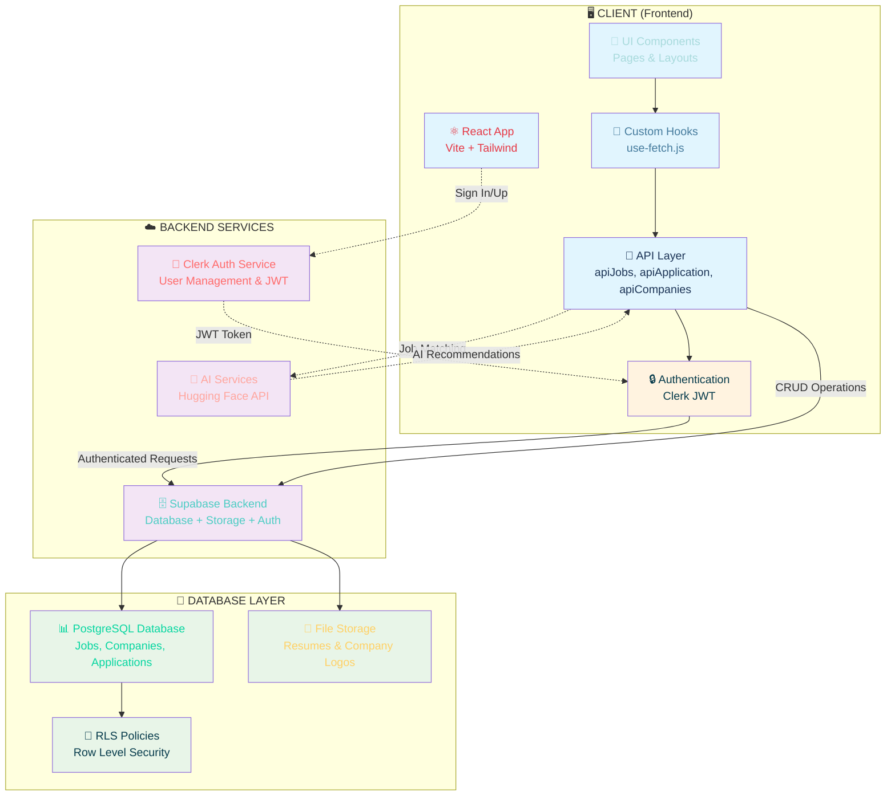
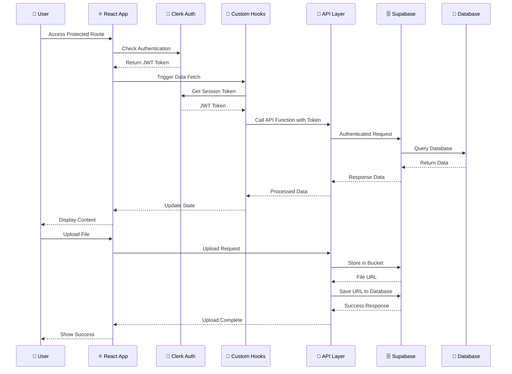
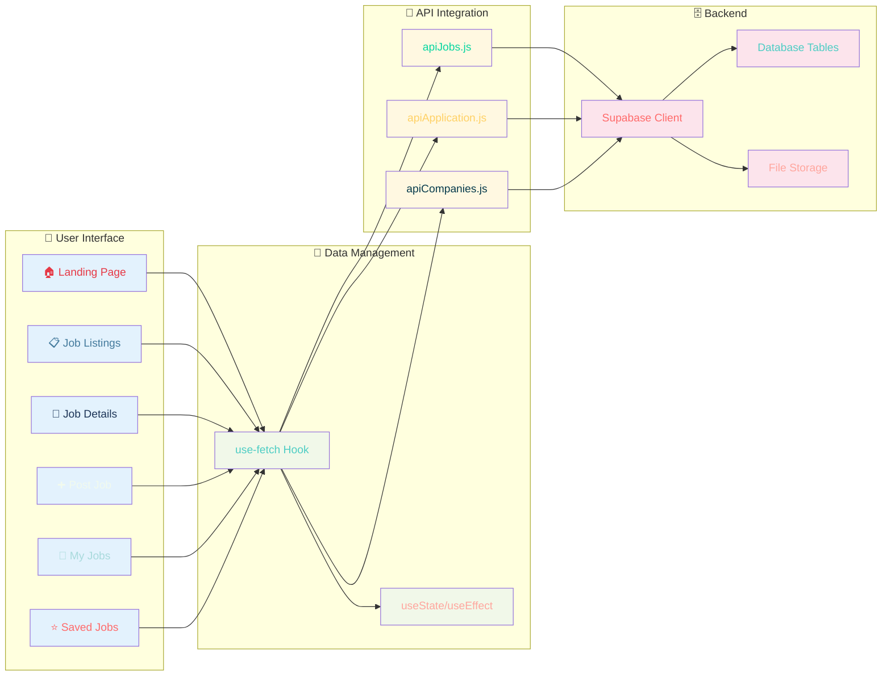
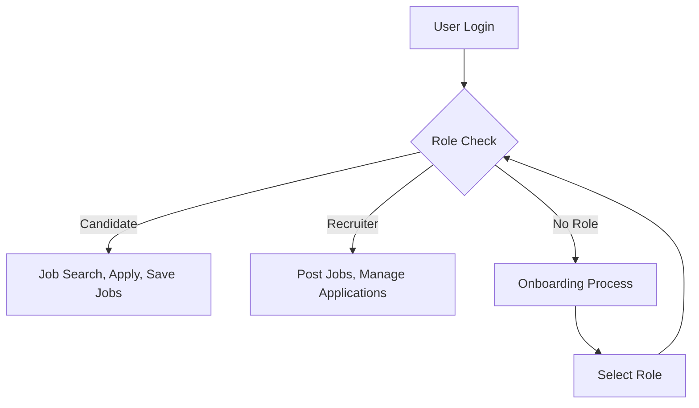

# JobSeek - AI-Powered Job Search Platform

[](https://job-seek-umber.vercel.app/)

JobSeek is an intelligent job search platform that leverages AI to help users find their dream jobs more effectively. The platform provides personalized job recommendations, resume analysis, and smart matching algorithms.


## 🚀 Live Demo

#### Visit our live application at: [JOB-SEEK](https://job-seek-umber.vercel.app/)

## 🛠️ Tech Stack

### Frontend
- React.js (Vite) - Fast and modern frontend framework
- Tailwind CSS - Utility-first CSS framework
- Clerk - Authentication and user management
- Zod - TypeScript-first schema validation

Subham Mondal

### Backend
- Supabase - Backend as a Service (BaaS)
  - Database
  - Authentication
  - RLS Policy Secured database
  - Storage

<!-- ### AI Integration
- Hugging Face - Mistral-7B-Instruct-v0.2
  - Job matching and recommendations
  - Semantic search capabilities
  - Natural language processing -->

## 🛠️ Setup Instructions

1. Clone the repository:
```bash
git clone https://github.com/SjxSubham/JOB-SEEK

```

2. Install dependencies:
```bash
npm install
```

3. Environment Setup:
   - Copy `.env.sample` to `.env`
   - Add your own API keys and configuration values
   - Required environment variables:
     - `VITE_SUPABASE_URL`: Your Supabase project URL
     - `VITE_SUPABASE_ANON_KEY`: Your Supabase anonymous key
     - `VITE_CLERK_PUBLISHABLE_KEY`: Your Clerk publishable key
     - `VITE_HUGGINGFACE_API_TOKEN`: Your Hugging Face API token
     - Other configuration variables as specified in `.env.sample`

4. Run the development server:
```bash
npm run dev
```

5. Build for production:
```bash
npm run build
npm preview
```

## 🤖 AI Integration and Job Matching

### AI Job Recommendation Feature

The AI Job Recommendation feature uses the Mistral-7B-Instruct-v0.2 model from Hugging Face to provide personalized job matches based on user profiles. Here's how it works: (work is still going on...)

### Frontend Implementation
- Located in `src/components/AIJobRecommendation.tsx`
- Collects user profile data including:
  - Skills
  - Years of experience
  - Preferred location
  - Remote work preference
  - Salary expectations
  - Job type preferences
  - Education background
- Displays job matches in a clean card layout with:
  - Job title and company
  - Match score
  - Job description
  - Required skills

### Backend Implementation
- Uses Hugging Face's API with Mistral-7B-Instruct-v0.2 model
- Located in `src/services/aiService.ts`
- Processes user profile data and generates a structured prompt
- Returns top 3 job matches with match scores and relevant details

### Environment Setup
1. Add your Hugging Face API key to `.env`:
```
VITE_HUGGINGFACE_API_KEY=your_api_key_here
```

### Usage
1. Navigate to the AI Job Recommendation section
2. Fill in your profile details
3. Click "Find My Matches"
4. View your personalized job recommendations

### Technical Details
- The AI model analyzes the user profile and generates job matches based on:
  - Skill compatibility
  - Experience level
  - Location preferences
  - Salary expectations
  - Job type preferences
- Each match includes a match score (0-1) indicating the relevance
- The response is formatted in JSON and processed for display

## 📚 API Documentation

### Authentication

The platform uses Clerk for authentication. To access protected endpoints, include the session token in the request headers (modify youself as per the requirements):

```javascript
headers: {
  'Authorization': `Bearer ${sessionToken}`,
  'Content-Type': 'application/json'
}
```

### Endpoints


#### Jobs

- `GET /api/jobs` - Get all jobs
- `GET /api/jobs/:id` - Get job by ID
- `POST /api/jobs` - Create new job
- `PUT /api/jobs/:id` - Update job
- `DELETE /api/jobs/:id` - Delete job

#### Companies

- `GET /api/companies` - Get all companies
- `GET /api/companies/:id` - Get company by ID
- `POST /api/companies` - Create new company
- `PUT /api/companies/:id` - Update company
- `DELETE /api/companies/:id` - Delete company

#### Users

- `GET /api/users/profile` - Get user profile
- `PUT /api/users/profile` - Update user profile
- `GET /api/users/saved-jobs` - Get user's saved jobs
- `POST /api/users/saved-jobs/:jobId` - Save a job
- `DELETE /api/users/saved-jobs/:jobId` - Remove a saved job

### RESTful endpoint for querying and managing your database
#### URL - https://wzmpiaqjnegnitfnahue.supabase.co
### Diagrams and workflows
## 🏗️ Code Architecture

### Frontend Structure
```
├── public/    # static assets
├── src/
│   ├── components/     # Reusable UI components
│   │   ├── ui/    # Job listing card component
│   ├── data/          # JSON Data
│   ├── pages/         # React pages and routing
│   ├── hooks/         # fectching database.data
│   ├── styles/        # Global styles and Tailwind config
│   ├── utils/         # Helper functions and utilities
│   ├── api/           # Supabase and API integration
|   ├── lib/
│   └── types/         # TypeScript type definitions
├── .env.sample        # Environment variables template
└── vite.config.ts     # Vite configuration
```

### Complete Project File Structure

```
JOB-SEEK/
├── 📁 public/                    # Static assets
│   ├── 🖼️ vite.svg
│   └── 📄 index.html
├── 📁 src/                       # Source code
│   ├── 📁 api/                   # Supabase API integration layer
│   │   ├── 🔧 apiJobs.js         # Job CRUD operations
│   │   ├── 🔧 apiApplication.js  # Application management
│   │   └── 🔧 apiCompanies.js    # Company data operations
│   ├── 📁 components/            # Reusable UI components
│   │   ├── 📁 ui/                # Base UI components
│   │   ├── 🧩 header.jsx         # Navigation header
│   │   ├── 🔒 protected-route.jsx # Route protection
│   │   └── 🎨 theme-provider.jsx # Theme management
│   ├── 📁 data/                  # Static JSON data
│   │   ├── 📊 companies.json     # Company listings
│   │   └── ❓ faq.json           # FAQ content
│   ├── 📁 hooks/                 # Custom React hooks
│   │   └── 🎣 use-fetch.js       # Data fetching hook
│   ├── 📁 layouts/               # Layout components
│   │   └── 📐 app-layout.jsx     # Main app layout
│   ├── 📁 lib/                   # Utility libraries
│   ├── 📁 pages/                 # React pages/routes
│   │   ├── 🏠 landing.jsx        # Landing page
│   │   ├── 👤 onboarding.jsx     # User onboarding
│   │   ├── 📋 jobListing.jsx     # Job listings
│   │   ├── 📄 job.jsx            # Job details
│   │   ├── ➕ post-job.jsx       # Job posting
│   │   ├── 💼 my-jobs.jsx        # Recruiter jobs
│   │   └── ⭐ saved-jobs.jsx     # Saved jobs
│   ├── 📁 utils/                 # Helper utilities
│   │   └── 🔌 supabase.js        # Supabase client config
│   ├── 🎨 App.css               # Global styles
│   ├── ⚛️ App.jsx               # Main App component
│   ├── 🎨 index.css             # Base styles
│   └── 🚀 main.jsx              # App entry point
├── 📄 .env.sample               # Environment variables template
├── 📄 .gitignore               # Git ignore rules
├── 📄 components.json          # shadcn/ui config
├── 📄 eslint.config.js         # ESLint configuration
├── 📄 jsconfig.json            # JavaScript config
├── 📄 package.json             # Dependencies & scripts
├── 📄 postcss.config.js        # PostCSS config
├── 📄 README.md                # Project documentation
├── 📄 tailwind.config.js       # Tailwind CSS config
├── 📄 vercel.json              # Vercel deployment config
└── 📄 vite.config.js           # Vite build config
```


### Client-Server Architecture & Data Flow



### Data Flow Diagram



### Component Communication Flow



### Key Technologies
- React.js (Vite) for fast development and building
- Supabase for backend services and database
- Clerk with JWT for secure authentication
- Tailwind CSS for styling (clean and responsive UI )
- Zod for runtime type checking and validation

## 🔄 Working Features & Data Flow Patterns

### 1. Authentication Flow
```
User Login → Clerk Authentication → JWT Token → Supabase RLS → Database Access
```

### 2. Job Search & Listing
```
Search Input → API Filter → Supabase Query → Database → Filtered Results → UI Display
```

### 3. Job Application Process
```
Apply Button → Resume Upload → File Storage → Application Record → Database → Email Notification
```

### 4. Job Posting (Recruiter)
```
Job Form → Validation → Company Logo Upload → Job Creation → Database → Live Listing
```

### 5. Save/Unsave Jobs
```
Save Action → Check Auth → Toggle Saved State → Database Update → UI Refresh
```

### 6. Real-time Features
- **Live Job Updates**: Supabase real-time subscriptions
- **Application Status**: Real-time status changes
- **New Job Notifications**: Instant updates when jobs match criteria

### 7. File Management
```
File Upload → Supabase Storage → URL Generation → Database Reference → Display/Download
```

### 8. Role-based Access Control


### 9. Data Validation Flow
```
Form Input → Zod Schema → Client Validation → API Request → Server Validation → Database
```

### 10. Error Handling Pattern
```
API Request → Error Check → User-friendly Message → Fallback UI → Retry Mechanism
```

## ⚖️ Trade-offs and Assumptions

### Trade-offs
1. **Performance vs. Features**
   - Real-time AI analysis may impact response times
   - Caching strategies implemented for optimization
   - Supabase real-time subscriptions for live updates
   - Rate limiting for AI API calls

2. **Scalability**
   - Supabase handles database scaling
   - Clerk manages authentication scaling
   - AI service rate limits considered in design
   - Ready for horizontal scaling if needed

### Assumptions
1. **User Behavior**
   - Users will provide accurate profile information
   - Regular updates to job preferences
   - Secure authentication through Clerk
   - Willing to wait for AI processing

2. **Data Quality**
   - Job listings are up-to-date
   - Resume data is in supported formats
   - Data validation through Zod schemas
   - AI model responses are reliable

## 📋 Quick Reference

### Key File Locations
| Component | File Path | Purpose |
|-----------|-----------|---------|
| 🔧 API Layer | `src/api/` | Supabase integration functions |
| 🎣 Data Hooks | `src/hooks/use-fetch.js` | Custom data fetching logic |
| 🔌 Supabase Config | `src/utils/supabase.js` | Database client setup |
| 🚪 Routing | `src/App.jsx` | React Router configuration |
| 🔒 Auth Guard | `src/components/protected-route.jsx` | Route protection logic |
| 📱 Pages | `src/pages/` | Main application views |
| 🎨 Components | `src/components/` | Reusable UI elements |

### Environment Variables
```bash
VITE_SUPABASE_URL=your_supabase_project_url
VITE_SUPABASE_ANON_KEY=your_supabase_anon_key
VITE_CLERK_PUBLISHABLE_KEY=your_clerk_publishable_key
VITE_HUGGINGFACE_API_TOKEN=your_huggingface_token
JWT_ISSUER_DOMAIN=your_jwt_issuer_domain
```

### Development Commands
```bash
npm install          # Install dependencies
npm run dev          # Start development server
npm run build        # Build for production
npm run preview      # Preview production build
npm run lint         # Run ESLint
```

### Database Schema Overview
```
📊 Tables:
├── users          # User profiles and roles
├── companies      # Company information
├── jobs          # Job listings
├── applications  # Job applications
└── saved_jobs    # User saved jobs

🗂️ Storage Buckets:
├── resumes       # PDF resume files
└── company-logo  # Company logo images
```

## 📝 License

This project is licensed under the MIT License - see the LICENSE file for details.

## 🤝 Contributing

Contributions are welcome! Please read our contributing guidelines before submitting pull requests.

## 📧 [Feedback](https://feed-x-widget.vercel.app/?projectId=29&projectName=JOB-SEEK)

For support or inquiries, Feedback please reach out to - [Here](https://feed-x-widget.vercel.app/?projectId=29&projectName=JOB-SEEK)
